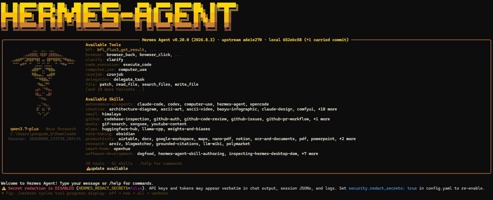
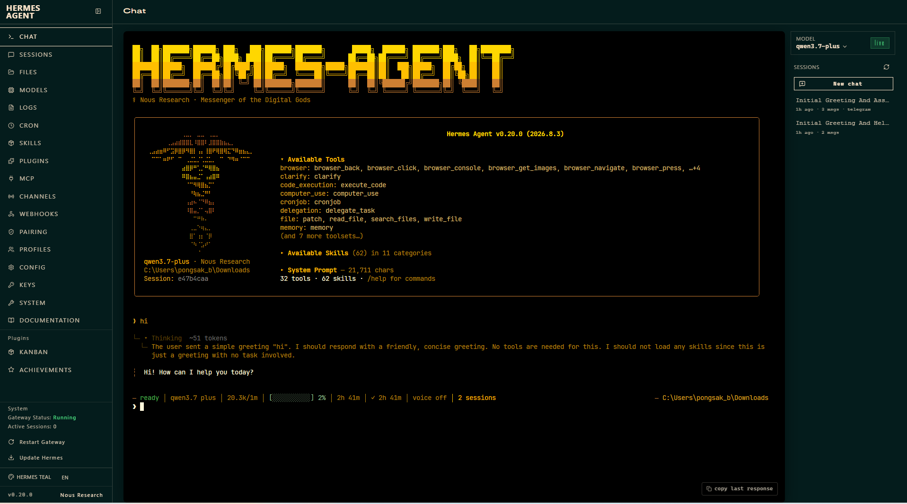
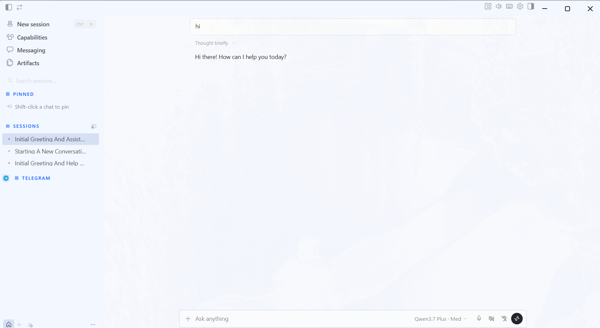
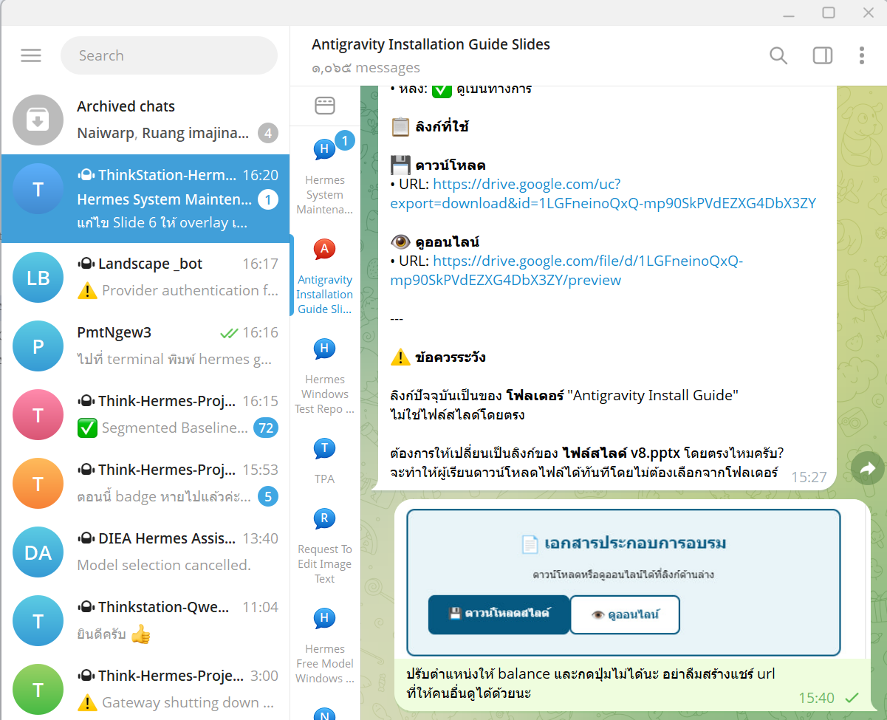
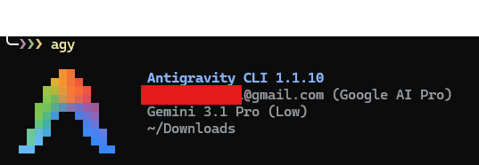

# Module 02: Hermes Installation & Setup (Windows)

## 🎯 Module Objectives

After completing this module, you will be able to:

1. Install Hermes Agent on Windows (no admin rights required)
2. Configure OKMD API Key (Free 23 Models) and Telegram Bot
3. Use all 5 interfaces: CLI, TUI, Dashboard, Desktop, Telegram
4. Use agy (Antigravity CLI) for repairs
5. Change API Key and models after installation
6. Troubleshoot common installation issues

---

## 📋 Prerequisites

Before starting, you need:

| Item | How to Get |
|------|-----------|
| **OKMD API Key** | Free signup at https://playground.okmd.or.th |
| **Telegram Bot Token** | Create via @BotFather in Telegram |
| **Telegram Chat ID** | Get from @userinfobot in Telegram |

---

## 🚀 Step 1: Quick Install

### Option A: PowerShell (Recommended)

```powershell
irm https://raw.githubusercontent.com/pbseiya/hermes-free-model-guide/master/scripts/install-windows.ps1 | iex
```

### Option B: CMD

```cmd
powershell -ExecutionPolicy Bypass -Command "irm https://raw.githubusercontent.com/pbseiya/hermes-free-model-guide/master/scripts/install-windows.ps1 | iex"
```

### Option C: Double-click

1. Download `install-windows.bat` from GitHub
2. Double-click to run

---

## 📦 What Gets Installed

The script installs these components in user-space:

| Component | Purpose |
|-----------|---------|
| **Git** (portable) | Version control |
| **Node.js v22** (portable) | Dashboard & Desktop |
| **Python 3.11** (embeddable) | Hermes runtime |
| **uv** | Python package manager |
| **Hermes Agent** | AI assistant + Gateway + Dashboard + Desktop + TUI |
| **Antigravity CLI (agy)** | Repair tool (Gemini free tier) |

**All installed in:** `%LOCALAPPDATA%\hermes\` (no admin required)

### Installation Time

| Phase | Time |
|-------|------|
| Prerequisites (Git, Node, Python, uv) | 3-5 min |
| Hermes Agent (Python + npm) | 5-15 min |
| Web UI build (Dashboard) | 1-2 min |
| Desktop build (Electron) | 3-5 min |
| **Total** | **10-20 min** |

---

## ⚠️ Important: Antivirus

**Temporarily disable antivirus during installation** for Dashboard and Desktop to work properly.

If you don't disable it:
- ✅ Hermes CLI + Telegram will work
- ❌ Dashboard + Desktop will need manual fix (see Troubleshooting)

---

##  Step 2: Initial Configuration

During installation, you'll be prompted for:

### 1. OKMD API Key (FREE - Primary Provider)
- Signup free at https://playground.okmd.or.th
- Login with Google Account
- Go to Settings → API Platform
- Generate API Key (starts with `sk_...`)
- **After entering key, the script auto-queries 23 available models from OKMD**

### 2. LiteLLM API Key (Optional - Fallback for Course 0)
- Provided by instructor
- Press Enter to skip if not needed

### 3. Telegram Bot Token
- Create bot via @BotFather
- Send `/newbot` command
- Copy the token

### 4. Telegram Chat ID
- Get from @userinfobot
- Restricts bot access to you only

**Can skip all prompts** and configure later (see Step 7).

---

## 📂 Step 3: Verify Installation

Open a **new PowerShell window** and run:

```powershell
# Check version
hermes --version

# Start chat
hermes

# Test a message
hermes chat -q "สวัสดี"
```

If `hermes` command not found, try:
```powershell
& "$env:LOCALAPPDATA\hermes\hermes-agent\venv\Scripts\hermes.exe"
```

---

## 🖥️ Step 4: Five Ways to Use Hermes

Hermes Agent provides **5 different interfaces** for different use cases:

### 1. Hermes CLI (Terminal Chat)

The classic command-line interface for direct chat with the agent.

```powershell
hermes
```

<p align="center"></p>

**Features:**
- Interactive chat with reasoning display
- 29 tools + 62 skills available
- Session management
- Model switching with `/model`

---

### 2. Hermes TUI (Terminal UI)

Modern terminal UI with rich interface inside your terminal.

```powershell
hermes --tui
```

**Features:**
- Modern TUI with panels and navigation
- Works inside any terminal
- No browser required
- Full tool and skill access

---

### 3. Hermes Dashboard (Web UI)

Web-based dashboard accessible via browser.

```powershell
hermes dashboard
```

Opens at: **http://localhost:9119**

<p align="center"></p>

**Features:**
- Session history and management
- Cron jobs management
- Tools & skills browser
- Configuration viewer
- Usage statistics
- Models page (23 free models available)
- Channels, Plugins, MCP servers management
- Embedded TUI terminal

---

### 4. Hermes Desktop (Native App)

Electron-based native desktop application.

```powershell
hermes desktop
```

<p align="center"></p>

**Features:**
- Native window experience
- All Dashboard features
- Integrated terminal
- Pet animations
- Voice input support
- Multi-session tabs

---

### 5. Telegram Gateway

Messaging platform integration for chat via Telegram.

```powershell
hermes gateway start
```

<p align="center"></p>

**Features:**
- Chat via Telegram bot
- Auto-start after reboot (Task Scheduler or Startup Folder)
- Model switching with `/model` command (23 models)
- Session management
- Cron job delivery to Telegram

**Auto-start Behavior:**
- `HermesGateway` task (30s delay after login) via Task Scheduler
- `HermesDashboard` task (60s delay after login) via Task Scheduler
- **Fallback:** If Task Scheduler fails (Access denied), shortcuts are created in Startup Folder

**Manual Start (if needed):**
```powershell
hermes gateway start
hermes dashboard
```

**Check Auto-start:**
```powershell
# Check Task Scheduler
schtasks /Query /TN "HermesGateway"
schtasks /Query /TN "HermesDashboard"

# Check Startup Folder
dir "$env:APPDATA\Microsoft\Windows\Start Menu\Programs\Startup"
```

---

## 🔧 Step 5: Antigravity CLI (agy)

`agy` is a repair tool powered by Google Gemini (free tier). Use it when Hermes has problems.

```powershell
agy
```

<div align="center">
  
</div>

**Features:**
- Free Gemini 3.1 Pro access
- Fix broken Hermes installations
- Repair configuration issues
- Diagnose problems

**First Run:**
- Requires Google Account login
- Free tier has rate limits (enough for repairs)

**Common Uses:**
```powershell
agy fix                    # Auto-fix common issues
agy doctor                 # Diagnose problems
agy repair hermes          # Repair Hermes installation
```

---

## 🧠 Step 6: Model Configuration

### Default Setup

- **Model:** `deepseek-v4-flash`
- **Provider:** OKMD AI Playground (Free)
- **Context Length:** 1,000,000 tokens
- **Base URL:** `https://gen.ai.kku.ac.th/okmd/api/v1`

### Auto-Queried Models (23 free models available)

The install script automatically queries the OKMD API and configures all available models:

| # | Model | # | Model |
|---|-------|---|-------|
| 1 | deepseek-v4-flash | 13 | gpt-5.4 |
| 2 | deepseek-v4-pro | 14 | gpt-5.4-mini |
| 3 | gpt-5.4-nano | 15 | gemini-3.5-flash |
| 4 | gemini-3.1-pro-preview | 16 | gemini-3.1-flash-lite |
| 5 | gemini-3.1-flash-lite-preview | 17 | gemini-2.5-flash-lite |
| 6 | llama-4-maverick | 18 | llama-4-scout |
| 7 | mistral-medium-3.1 | 19 | nova-2-lite-v1 |
| 8 | nova-pro-v1 | 20 | sonar-pro |
| 9 | qwen3.7-plus | 21 | qwen3.7-max |
| 10 | qwen3.6-flash | 22 | qwen3.5-9b |
| 11 | grok-4.3 | 23 | claude-sonnet-5 |
| 12 | claude-sonnet-4.6 | | |

### Switch Models

**In CLI/TUI:**
```text
/model deepseek-v4-pro
/model gpt-5.4-mini
```

**In Telegram:**
```text
/model
```
Then select from the inline button menu (shows all 23 models).

**In Dashboard:**
Click the model dropdown in the top-right corner.

---

## 🔒 Step 7: Security Settings

Default configuration:

```yaml
approvals:
  mode: off              # No command approval needed
telegram:
  reactions: true        # Auto-react to messages
security:
  redact_secrets: false  # Don't hide secrets in logs
privacy:
  redact_pii: false      # Don't hide personal info
```

**Note:** These settings are relaxed for training. Adjust for production use.

---

## 🔑 Step 8: Change API Key After Installation

**⚠️ Important:** `hermes setup` does NOT ask for API key for custom providers (OKMD is a custom provider).

Must use one of these methods:

### Method 1: Edit .env File Directly (Recommended)

```powershell
notepad %LOCALAPPDATA%\hermes\.env
```

Add or modify:
```
OKMD_API_KEY=sk_YOUR_KEY_HERE
```

### Method 2: Use hermes env set

```powershell
hermes env set OKMD_API_KEY sk_YOUR_KEY_HERE
```

### Method 3: Use echo (Linux/Mac)

```bash
echo "OKMD_API_KEY=sk_YOUR_KEY_HERE" >> ~/.hermes/.env
```

### Apply Changes

```powershell
hermes gateway restart
hermes chat -q "สวัสดี"   # Test
```

---

## 🛠️ Troubleshooting

### Problem 1: `hermes` Command Not Found

**Solution:**
```powershell
# Open new PowerShell window
# Or use full path:
& "$env:LOCALAPPDATA\hermes\hermes-agent\venv\Scripts\hermes.exe"
```

### Problem 2: Dashboard Not Working

**Cause:** Antivirus blocked npm during installation

**Solution:**
```powershell
cd %LOCALAPPDATA%\hermes\hermes-agent
npm install --no-fund --no-audit
npm run build -w web
```
Then restart: `hermes dashboard`

### Problem 3: Desktop Shows Errors on First Launch

**Normal warnings (harmless):**
- `[DIRTY] from local` — Git working tree not clean at build time
- `registry key not found` — Optional Windows registry lookup
- `WSL is not installed` — Informational, Hermes doesn't need WSL
- `Session not found (404)` — Race condition at startup, self-heals

**Only investigate if:** Desktop window fails to open or shows blank screen.

### Problem 4: Telegram Bot Not Responding

**Check:**
```powershell
# Is gateway running?
Get-Process -Name pythonw

# View logs
type %LOCALAPPDATA%\hermes\logs\gateway.log

# Restart gateway
hermes gateway restart
```

### Problem 5: Services Not Starting After Reboot

**Check Task Scheduler:**
```powershell
schtasks /Query /TN "HermesGateway"
schtasks /Query /TN "HermesDashboard"
```

**If tasks not found (Access denied during install):**

Create shortcuts manually in Startup Folder:

1. Open Startup Folder:
```powershell
explorer "$env:APPDATA\Microsoft\Windows\Start Menu\Programs\Startup"
```

2. Create shortcut for Gateway:
- Right-click → New → Shortcut
- Location: `C:\Users\<YourUsername>\AppData\Local\hermes\hermes-agent\venv\Scripts\hermes.exe gateway start`
- Name: `HermesGateway`

3. Create shortcut for Dashboard:
- Right-click → New → Shortcut
- Location: `C:\Users\<YourUsername>\AppData\Local\hermes\hermes-agent\venv\Scripts\hermes.exe dashboard`
- Name: `HermesDashboard`

**Or use PowerShell to create shortcuts:**
```powershell
$WshShell = New-Object -ComObject WScript.Shell
$Shortcut = $WshShell.CreateShortcut("$env:APPDATA\Microsoft\Windows\Start Menu\Programs\Startup\HermesGateway.lnk")
$Shortcut.TargetPath = "$env:LOCALAPPDATA\hermes\hermes-agent\venv\Scripts\hermes.exe"
$Shortcut.Arguments = 'gateway start'
$Shortcut.Save()

$Shortcut2 = $WshShell.CreateShortcut("$env:APPDATA\Microsoft\Windows\Start Menu\Programs\Startup\HermesDashboard.lnk")
$Shortcut2.TargetPath = "$env:LOCALAPPDATA\hermes\hermes-agent\venv\Scripts\hermes.exe"
$Shortcut2.Arguments = 'dashboard'
$Shortcut2.Save()
```

### Problem 6: API Key Issues

**Solution:**
```powershell
# Check current config
hermes config

# Update API key (edit .env directly for custom providers)
notepad $env:LOCALAPPDATA\hermes\.env
# Add: OKMD_API_KEY=sk_YOUR_KEY_HERE

# Restart
hermes gateway restart
```

---

## 📚 Additional Resources

| File | Purpose |
|------|---------|
| `README.md` | Quick start guide |
| `CHANGELOG.md` | Version history |
| `guides/01-installation-guide.md` | Detailed installation steps |
| `guides/02-change-provider.md` | Change provider guide |
| `guides/03-okmd-setup.md` | OKMD signup guide |
| `guides/04-telegram-setup.md` | Telegram bot setup |
| `guides/05-troubleshooting.md` | Troubleshooting guide |
| [Releases](https://github.com/pbseiya/hermes-free-model-guide/releases) | Download releases |

---

## 📞 Support

If you encounter issues:
1. Check `guides/05-troubleshooting.md` for troubleshooting
2. Check [GitHub Issues](https://github.com/pbseiya/hermes-free-model-guide/issues)
3. Contact instructor via course channel

---

**Module completed:** You can now install, configure, and use all 5 Hermes interfaces on Windows with FREE OKMD models!
